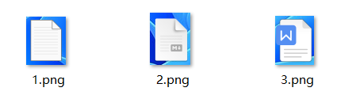
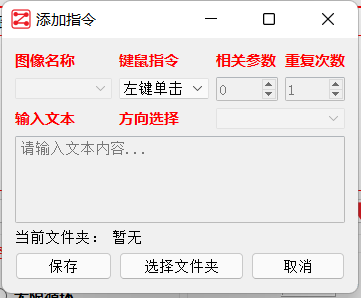
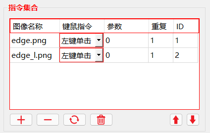
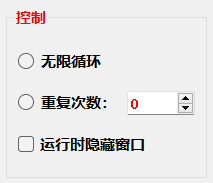
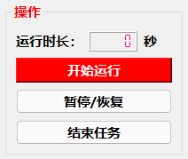

# CLICKER
## 简介
PyAutoGUI lets your Python scripts control the mouse and keyboard to automate interactions with other applications. The API is designed to be simple. PyAutoGUI works on Windows, macOS, and Linux, and runs on Python 2 and 3.

本软件是PyAutoGUI的可视化项目。PyAutoGUI是Python的第三方自动化库，PyAutoGUI能完全接管鼠标、键盘的控制权限，并能产生点击鼠标、敲击键盘的行为，完全模仿人类的操作。最初被用于GUI程序的自动化软件测试，因其简单高效的运作方式被广泛推广。

本软件基于PyAutoGUI开发，将PyAutoGUI的部分函数以图形化界面的形式展示，操作更简单，易于快速实现自动化作业。

## 安装教程

本软件以开放源代码的方式发行，您使用该软件无需支付任何费用。您需要先下载本软件的安装包SetUp.exe，并根据窗口提示安装运行即可。

## 使用说明

1. 您需要将执行鼠标点击操作的目标通过截图的方式保存其图像，文件名称随意但不能以中文命名，且图片格式为.png，将所有图片保存至任意工作文件夹下，文件夹名称随意但不能以中文命名。

2. 点击主窗体的指令集合模块中的“+”，以开启指令添加窗口，点击“选择文件夹”按钮，选中保存目标图像的工作文件夹，以激活添加指令功能。在“图像名称”下拉列表中选择目标图像，在“键鼠指令”下拉列表中选择将要对指定目标执行的操作，并根据相关控件设置操作的参数，最后点击“保存”按钮即可。

3. 添加指令后，在主窗体的“指令集合”表格中会显示已保存的指令及参数，也可在表格中直接修改指令和参数。通过功能按钮实现“添加指令”、“删除指令”、“刷新”、“删除所有指令”、“上移和下移执行顺序”功能。

4. 在“控制”窗体中选择执行所有指令的次数，或在运行中不显示主窗体。注意：所有指令按顺序执行，当程序未识别到目标时将直接跳过执行该步骤的鼠标点击操作。

5. 在“操作”模块中点击“开始运行”，即可开始执行所有指令。在运行过程中，按“Escape”键即可终止运行，按“S”键暂停运行，按“R”恢复运行。

## 贡献者

**FasterThanLight**

邮箱：federalsadler@sohu.com

QQ：2309636438
